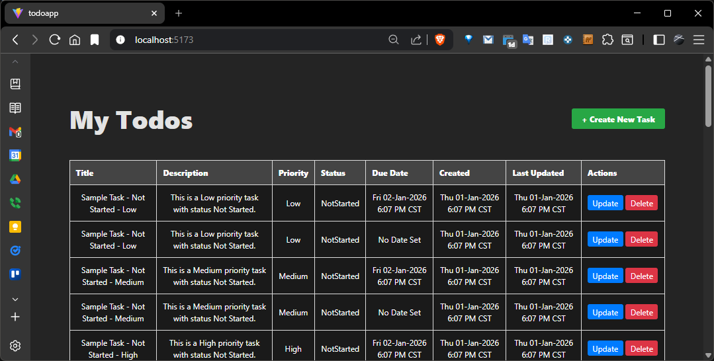

# Todo App

## Objective

Build a small to-do task management API and frontend. This test evaluates:

- Backend API design with .NET Core.
- Data structure design with EF Core in memory.
- Frontend component design with React.
- Communication between frontend and backend.
- Clean code, architecture structure, and thought process.
- Trade-offs and assumptions.
- Include a short README.md with setup steps and your explanation notes.
- Comments or a README.md explaining assumptions, scalability, and what you would implement in the future.
- Submit a GitHub repo link with both frontend and backend projects.
- Add any features you feel are required for a Production MVP.

## How to Run the App

Run backend from the root directory of the repo

```powershell
dotnet run
```

Build and run React frontend in a separate powershell

```powershell
cd .\Frontend\todoapp\
npm install
npm run dev
```

The app will launch with test data created.



### Test API

[Swagger Test URL](https://localhost:7103/swagger/index.html)

[Local URL for Frontend](http://localhost:5173/)

### React Commands

Stop Node App

```powershell
taskkill /f /im node.exe
```

Install Node Moduels after a clean

```powershell
npm install
```

Run the React App

```powershell
npm run dev
```

## Future Enhancements

### Backend

Add a table, repository, and controller for notes on a task. [TableBase.cs](.\Models\TableBase.cs) is uesed to define the columns that all tables require. It is also used in [IRepository.cs](.\Repository\IRepository.cs) in a generic `where` clause to ensure that all tables inherit from `TableBase` when implementing the interface.

Implement tempral tables for audit logging. Logging should be by design and not full dependant on the engineer wrting logging code.

Add the ablity to assign a user to a task. Add a table, repository, and controller for users.

Add unit tests and code coverage.

Implement Specflow tests to run the app and mimic a user using the app.

### Frontend

Sortable columns

Pagination

Store to keep track of data and not fully reload table on every action.

Fix the display of dates on the frontend. The dates are properly being saved to the database but are not translating from C# `DataTime` to JavaScript `Date`.